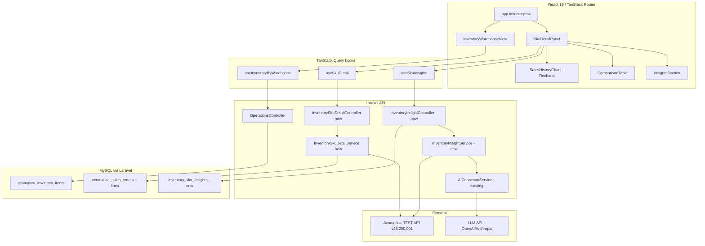

# Design Document: Inventory Module

## Overview

The Inventory Module extends the existing `/app/inventory` route into a three-capability feature:
warehouse inventory listing grouped by warehouse and band, an interactive SKU detail slide-over
with historical sales and AI-generated predictions, and AI-powered insight generation that cross-references
promotional events and price changes against sales variance.

The feature is built on the existing stack: React 19, TanStack Router, TanStack Query, Recharts,
and a Laravel backend that caches Acumatica REST API (v23.200.001) data before surfacing it to the
frontend. All new AI work lives server-side in Laravel, calling the existing `AiConnectorService`
to reach an LLM API (OpenAI or Anthropic, as already configured).

The existing `app.inventory.tsx` route, `useOperations.ts` hook, and `OperationsController` are
extended rather than replaced. New capabilities are added as new endpoints, a new React component
(`SkuDetailPanel`), and two new Laravel services.

---

## Architecture



Data flow summary:
1. The listing view reads from `acumatica_inventory_items` (already synced via existing cron).
2. The SKU detail view reads `acumatica_sales_orders` / `acumatica_sales_order_lines` from MySQL,
   then requests AI predictions from the LLM through the existing connector.
3. The insights service queries Acumatica live for promotions and price history,
   then sends the combined context to the LLM and caches the result in `inventory_sku_insights`.

---

## Components and Interfaces

### Frontend Components

#### `InventoryWarehouseView`

Replaces the current flat table in `app.inventory.tsx` with a warehouse-grouped, band-sub-grouped view.

Props: `items: InventoryItem[]`, `onSkuClick: (item: InventoryItem) => void`

Renders one collapsible `<WarehouseSection>` per unique `default_warehouse_id`. Each section contains
one collapsible `<BandSubGroup>` per band (A, B, C, D, Unclassified) and a `<WarehouseStatCard>`
showing total SKU count, total `qty_on_hand`, and count of SKUs with `days_until_stockout ≤ 14`.

Warehouses with zero items after active filters are hidden entirely (not rendered).

#### `SkuDetailPanel`

A slide-over panel (using the existing `vaul` Drawer or Radix Sheet from the UI library) that opens
when the user clicks a SKU row.

Props: `inventoryId: string | null`, `onClose: () => void`

Internal state: `dateRange: { from: Date; to: Date }` (default: 90 days ending today).

Renders:
- Metadata header (pulled from `useSkuDetail`)
- `<DateRangePicker>` (min 7 days, max 730 days)
- `<SalesHistoryChart>` (Recharts ComposedChart)
- `<ComparisonTable>`
- `<InsightsSection>`

Responds to Escape key via `useEffect` on `keydown` and closes on overlay click.

#### `SalesHistoryChart`

Recharts `ComposedChart` with:
- `Bar` series for historical `shipped_qty` per month (blue)
- `Line` series for AI predicted units per month (amber dashed)
- X-axis: month labels (e.g. "Jan 2024")
- Y-axis: units

#### `ComparisonTable`

Tabular listing of combined historical + prediction period months with columns:
Month | Predicted Units | Actual Units Sold.

Row highlighting:
- Green (`bg-green-50 border-l-4 border-green-500`) when `(actual - predicted) / predicted × 100 > 20`
- Amber (`bg-amber-50 border-l-4 border-amber-500`) when `(predicted - actual) / predicted × 100 > 20`
- Actual Units Sold shows "—" for future months in the Prediction_Period.

#### `InsightsSection`

Renders the AI insight response as a structured finding list. Each finding is a card with a
type badge (`Promotion Impact` / `Price Change Impact` / `Unexplained Variance`) and the
finding text. Shows a Skeleton loader while the request is in flight. Shows an inline error
with a retry button on failure.

### Frontend Hooks

#### `useInventoryByWarehouse(params)`

Wraps the existing `useInventory` hook. Adds client-side grouping by `default_warehouse_id` and
band derivation, returning `Map<string, Map<BandLabel, InventoryItem[]>>`.

Query key: `["operations-inventory", params]` (same as existing — no new endpoint needed for listing).

#### `useSkuDetail(inventoryId, dateRange)`

```ts
type SkuDetailResponse = {
  item: InventoryItem & {
    item_status: string;
    valuation_method: string;
    last_cost: number;
    average_cost: number;
    last_modified_at: string | null;
  };
  monthly_sales: Array<{
    month: string;          // "YYYY-MM"
    month_label: string;    // "Jan 2024"
    shipped_qty: number;
    predicted_qty: number;
    is_future: boolean;
  }>;
  prediction_period: { from: string; to: string };
};
```

Query key: `["inventory-sku-detail", inventoryId, dateFrom, dateTo]`.
Enabled only when `inventoryId !== null`.
Timeout: 10 seconds (via `apiFetch` `timeoutMs` option).

#### `useSkuInsights(inventoryId, dateRange)`

```ts
type SkuInsightResponse = {
  insights: Array<{
    type: "promotion_impact" | "price_change_impact" | "unexplained_variance";
    month: string;
    text: string;
    promotion_name?: string;
    variance_pct?: number;
    variance_abs?: number;
    price_direction?: "upward" | "downward";
    price_magnitude?: number;
  }>;
  data_gaps?: string[];
  ai_status: "success" | "failed" | "unavailable";
};
```

Query key: `["inventory-sku-insights", inventoryId, dateFrom, dateTo]`.
Uses `keepPreviousData: false` and cancels on parameter change via TanStack Query's built-in
`AbortController` integration (staleTime: 0, gcTime: 0).

### Backend Endpoints (New)

#### `GET /api/operations/inventory/{inventoryId}/sku-detail`

Query params: `date_from` (YYYY-MM-DD), `date_to` (YYYY-MM-DD).

Returns `SkuDetailResponse`. Handled by `InventorySkuDetailController@show`.

#### `GET /api/operations/inventory/{inventoryId}/insights`

Query params: `date_from`, `date_to`.

Returns `SkuInsightResponse`. Handled by `InventoryInsightController@show`.

30-second server-side timeout for the LLM call. Cached in `inventory_sku_insights` by
`(inventory_id, date_from, date_to)` for 4 hours to avoid redundant LLM calls.

---

## Data Models

### Existing Models (Extended Usage)

**`AcumaticaInventoryItem`** — the listing and detail header reads from this table.
Fields already present: `inventory_id`, `description`, `item_class`, `default_warehouse_id`,
`qty_on_hand`, `qty_available`, `valuation_method`, `sales_price`, `synced_at`.

Fields to add (via migration):
- `item_status` VARCHAR(50) — from `ItemStatus.value`
- `last_cost` DECIMAL(10,4) — from `LastCost.value`
- `average_cost` DECIMAL(10,4) — from `AverageCost.value`
- `last_modified_at` TIMESTAMP NULL — from `LastModified.value`

**`AcumaticaSalesOrder` + `AcumaticaSalesOrderLine`** — the SKU detail view queries these
for shipped quantities. No schema changes required. The query joins orders on `status = 'Completed'`
and `order_type = 'SO'`, filters lines by `inventory_id` and the order's `order_date` range.

### New Model: `InventorySkuInsight`

Table: `inventory_sku_insights`

| Column | Type | Notes |
|---|---|---|
| `id` | BIGINT PK | Auto-increment |
| `inventory_id` | VARCHAR(50) | Indexed |
| `date_from` | DATE | |
| `date_to` | DATE | |
| `ai_response` | JSON | Full `SkuInsightResponse` payload |
| `ai_status` | VARCHAR(20) | success / failed / unavailable |
| `data_gaps` | JSON NULL | Missing Acumatica sub-query results |
| `generated_at` | TIMESTAMP | |
| `expires_at` | TIMESTAMP | `generated_at + 4 hours` |

Unique index: `(inventory_id, date_from, date_to)`.

### Band Derivation Logic

The `ItemClass` field follows a pattern like `A_BEVERAGES`, `B_SNACKS`, `C_DAIRY`, `D_MISC`.
Band is extracted by taking the prefix before the first underscore (or the entire value if no
underscore) and matching against `{A, B, C, D}`. If no match, band is `"Unclassified"`.

```ts
function deriveBand(itemClass: string | null): "A" | "B" | "C" | "D" | "Unclassified" {
  if (!itemClass) return "Unclassified";
  const prefix = itemClass.split("_")[0].toUpperCase();
  if (["A", "B", "C", "D"].includes(prefix)) return prefix as "A" | "B" | "C" | "D";
  return "Unclassified";
}
```

### Run Rate and Days Until Stockout

These are already computed and stored in `acumatica_inventory_run_rate_logs` by the existing
`InventoryRunRatePredictor` service. The listing view reads the latest log entry per item
(same as current implementation).

### Prediction Period Calculation

```ts
function predictionPeriod(from: Date, to: Date): { from: Date; to: Date } {
  const lengthDays = differenceInDays(to, from);
  return {
    from: addDays(to, 1),
    to: addDays(to, 1 + lengthDays),
  };
}
```

### Monthly Bucketing

Sales order lines are grouped by calendar month (`YYYY-MM`) of the parent order's `order_date`.
`shipped_qty` values in the same month are summed. The backend returns one row per calendar month
that falls within the union of the historical period and the prediction period.

---

## Correctness Properties

*A property is a characteristic or behavior that should hold true across all valid executions of a
system — essentially, a formal statement about what the system should do. Properties serve as the
bridge between human-readable specifications and machine-verifiable correctness guarantees.*

### Property 1: Warehouse grouping is exhaustive and non-overlapping

*For any* array of inventory items where each item has a non-empty `default_warehouse_id`, the
warehouse grouping function should produce exactly one group per distinct `default_warehouse_id`
value present in the input, and every item should appear in exactly one group.

**Validates: Requirements 1.2, 1.3**

### Property 2: Search filter is case-insensitive and complete

*For any* list of inventory items and any non-empty search string, the filter function should return
exactly those items where `inventory_id.toLowerCase()` or `description?.toLowerCase()` contains
`searchString.toLowerCase()`, and no items outside this set.

**Validates: Requirements 1.7**

### Property 3: Warehouse filter restricts to selected warehouses only

*For any* non-empty set of selected warehouse IDs and any list of inventory items, the filter
function should return a list where every item's `default_warehouse_id` is in the selected set,
and no item from the selected warehouses is omitted.

**Validates: Requirements 1.8**

### Property 4: Stat card aggregates match item array values

*For any* array of inventory items assigned to a warehouse, the stat card values should satisfy:
`total_sku_count = items.length`, `total_qty_on_hand = sum(items[i].qty_on_hand)`, and
`low_days_count = count(items where days_until_stockout ≤ 14)`.

**Validates: Requirements 1.6**

### Property 5: DefaultWarehouseID parsing preserves value uppercased (round-trip)

*For any* non-empty string `w` representing a `DefaultWarehouseID.value`, parsing the Acumatica
JSON `{"value": w}` and then storing/reading back the `default_warehouse_id` column should produce
a string equal to `w.trim().toUpperCase()`.

**Validates: Requirements 1.10, 4.6**

### Property 6: StockItem field parsing round-trip

*For any* StockItem JSON object where `InventoryID.value`, `DefaultWarehouseID.value`, and
`ItemClass.value` are non-null, non-empty strings, parsing those three fields and then
re-serialising them should produce an object where each field's value and type are identical
to the original input (after case normalisation for `DefaultWarehouseID`).

**Validates: Requirements 4.1, 5.3**

### Property 7: Band derivation is total and deterministic

*For any* `ItemClass` string (including null, empty, no-underscore, or unrecognised prefix),
the `deriveBand` function should always return exactly one of `{A, B, C, D, Unclassified}`,
never throws, and returns the same value for the same input on every call.

**Validates: Requirements 4.7, 1.3**

### Property 8: Prediction period has correct start and equal length

*For any* historical date range `[from, to]` where `to >= from + 7` days, the prediction period
should start on `addDays(to, 1)` and have a length in days equal to `differenceInDays(to, from)`.

**Validates: Requirements 2.6**

### Property 9: Monthly bucketing sums ShippedQty correctly

*For any* list of sales order lines (each with an `order_date` and `shipped_qty`), the monthly
bucketing function should produce groups where:
- each group's `month` key is a unique `YYYY-MM` string derived from `order_date`,
- each group's `shipped_qty` equals the sum of `shipped_qty` for all lines whose `order_date`
  falls within that calendar month, and
- no line is double-counted or omitted.

**Validates: Requirements 2.5**

### Property 10: Variance indicator is green, amber, or none — exclusively and correctly

*For any* `predicted` ∈ [1, 999 999] and `actual` ∈ [0, 999 999]:
- the indicator is **green** if and only if `(actual - predicted) / predicted × 100 > 20`
- the indicator is **amber** if and only if `(predicted - actual) / predicted × 100 > 20`
- the indicator is **none** when neither condition holds

Exactly one of these three outcomes applies for any valid input pair. The conditions are
mutually exclusive because both `actual > predicted × 1.2` and `actual < predicted × 0.8`
cannot hold simultaneously.

**Validates: Requirements 2.9, 2.10, 5.5, 5.7**

### Property 11: ValuationMethod mapping is exhaustive for known values

*For any* `ValuationMethod.value` string, the label mapping function should return:
`"First In First Out"` for `"FIFO"`, `"Average Cost"` for `"Average"`,
`"Standard Cost"` for `"Standard"`, and the raw value unchanged for any other string.
The function never throws and never returns null.

**Validates: Requirements 4.5**

### Property 12: Price change pressure classification is deterministic

*For any* price change record with a non-null `old_price > 0` and a non-null `new_price > 0`:
- the classification is `"upward pressure on demand"` if and only if `new_price < old_price`
- the classification is `"downward pressure on demand"` if and only if `new_price > old_price`
- when `new_price == old_price` the record is not classified as a price change

**Validates: Requirements 3.6**

### Property 13: Insight finding type is always a valid enum member

*For any* insight response returned by the AI engine, every finding in the `insights` array
should have a `type` field equal to one of `"promotion_impact"`, `"price_change_impact"`, or
`"unexplained_variance"`. No other type values are valid.

**Validates: Requirements 3.4**

---

## Error Handling

### Frontend Error States

| Scenario | Behaviour |
|---|---|
| Initial load failure (`/operations/inventory`) | Full-page error message with retry button; no table or stat cards rendered |
| Reload failure (data previously loaded) | Inline error banner above the table with retry button; previous data preserved |
| SKU detail load failure | Inline error in panel with retry button; panel stays open |
| AI insights failure (timeout or API error after 30s) | Error message in Insights section with retry; chart and comparison table unaffected |
| Acumatica sub-query failure (promotions/price history) | Insights generated with available data; `data_gaps` array populated; note shown in UI |
| Zero-SKU response | Empty-state message "No inventory items found"; no warehouse sections or stat cards |
| No sales data for SKU | Message "No sales data available for this period" in chart area; no empty chart rendered |

### Backend Error Handling

- **Acumatica promotions endpoint failure**: `InventoryInsightService` catches the exception,
  appends `"promotions"` to `data_gaps`, and continues with only price history context.
- **Acumatica price history endpoint failure**: Same — appends `"price_history"` to `data_gaps`.
- **LLM timeout (30s)**: Returns `ai_status: "failed"` with an empty `insights` array.
- **Invalid date range** (`date_to - date_from < 7` or `> 730`): Controller returns HTTP 422
  with a validation error message.
- **Unknown `inventoryId`**: `InventorySkuDetailController` returns HTTP 404.
- **Cached insight retrieval**: If `expires_at > now()`, the cached `InventorySkuInsight` is
  returned immediately without calling the LLM.

### Cancellation

When the user changes the date range in the SKU detail panel, TanStack Query cancels the
in-flight `useSkuInsights` request automatically via the `AbortSignal` passed to `apiFetch`.
The backend's `InventoryInsightController` checks for request abortion before starting the LLM
call. If the LLM call has already started, it is not cancelled server-side (HTTP/1.1 limitation),
but the response is discarded by the frontend.

---

## Testing Strategy

### Unit Tests

Unit tests use **Vitest** (already configured in the project) for frontend logic and
**PHPUnit** for backend service logic.

Frontend unit tests cover:
- `deriveBand(itemClass)` — edge cases: null, empty, no underscore, unrecognised prefix
- `predictionPeriod(from, to)` — boundary values at 7 and 730 days
- `formatLastModified(iso, timezone)` — valid ISO 8601, missing value, non-parseable string
- `formatCost(value)` — numeric strings, zero, negative values, non-numeric input
- `mapValuationMethod(value)` — all three known values and unknown values
- `varianceIndicator(predicted, actual)` — specific boundary examples at exactly 20% threshold

Backend unit tests cover:
- `InventorySkuDetailService::monthlySales()` — specific month-boundary examples
- `InventoryInsightService::classifyPriceChange()` — increase, decrease, no change
- `InventoryInsightService::buildInsightContext()` — with and without promotions/price history

### Property-Based Tests

Property-based tests use **fast-check** (frontend, via `npm install --save-dev fast-check`) and
**PHPUnit** with a simple arbitrary generator helper (backend).

Each property test runs a **minimum of 100 iterations**.

**Frontend PBT (Vitest + fast-check)**:

```
Feature: inventory-module, Property 2: search filter is case-insensitive and complete
Feature: inventory-module, Property 3: warehouse filter restricts to selected warehouses only
Feature: inventory-module, Property 4: stat card aggregates match item array values
Feature: inventory-module, Property 5: DefaultWarehouseID parsing preserves value uppercased
Feature: inventory-module, Property 7: band derivation is total and deterministic
Feature: inventory-module, Property 8: prediction period has correct start and equal length
Feature: inventory-module, Property 9: monthly bucketing sums ShippedQty correctly
Feature: inventory-module, Property 10: variance indicator is green, amber, or none — exclusively and correctly
Feature: inventory-module, Property 11: ValuationMethod mapping is exhaustive for known values
Feature: inventory-module, Property 12: price change pressure classification is deterministic
Feature: inventory-module, Property 13: insight finding type is always a valid enum member
```

**Backend PBT (PHPUnit)**:

```
Feature: inventory-module, Property 1: warehouse grouping is exhaustive and non-overlapping
Feature: inventory-module, Property 5: DefaultWarehouseID parsing preserves value uppercased (round-trip)
Feature: inventory-module, Property 6: StockItem field parsing round-trip
```

### Integration Tests

Integration tests target the actual Laravel test database (SQLite in-memory) with factory-generated
data, except where Acumatica is mocked with `Http::fake()`.

- `GET /api/operations/inventory` returns items with required fields (Requirement 5.1)
- `GET /api/operations/inventory/{id}/sku-detail` returns `monthly_sales` array (Requirement 5.2)
- `GET /api/operations/inventory/{id}/insights` with `>20%` variance month returns a finding
  with valid `type` (Requirement 5.4)
- When a mocked Acumatica promotion overlaps a positive-variance month, the insight includes
  `type: "promotion_impact"` referencing the promotion name (Requirement 5.6)

### End-to-End Smoke Test

A single Playwright (or Vitest browser mode) smoke test:
1. Navigates to `/app/inventory`
2. Waits up to 10 seconds for at least one warehouse section heading to appear
3. Clicks the first SKU row
4. Asserts within 5 seconds that a `<canvas>` element (Recharts chart) is present in the DOM

(Requirement 5.8)
