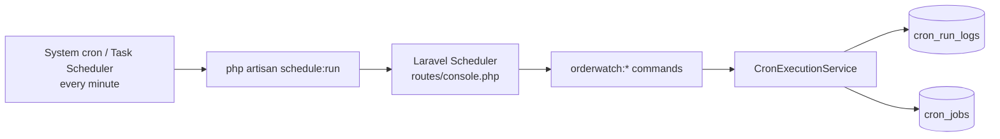

# OrderWatch — Cron Jobs Guide

This guide explains how scheduled jobs run in OrderWatch, how to start the Laravel scheduler in development and production, and how to verify that jobs are working.

All OrderWatch cron jobs run **synchronously inside Artisan commands**. They do **not** depend on a Laravel queue worker.

---

## How it works



1. **System scheduler** invokes `php artisan schedule:run` once per minute.
2. **Laravel Scheduler** (`backend/routes/console.php`) decides which `orderwatch:*` commands are due.
3. Each command uses **`CronExecutionService`** to:
   - skip disabled jobs
   - enforce minimum intervals between successful runs
   - acquire a cache lock to prevent overlapping runs
   - write a row to **`cron_run_logs`**
   - update **`cron_jobs`** (`last_run_at`, `last_run_status`, etc.)

Job definitions are seeded into the `cron_jobs` table via `CronJob::ensureDefaults()` (called on boot and when the admin API loads jobs). Only jobs with `is_enabled = true` and `status = active` are registered with the scheduler.

---

## Prerequisites

From the `backend/` directory:

```bash
php artisan migrate
```

Ensure these are configured in `backend/.env`:

| Variable | Purpose |
|----------|---------|
| `DB_*` | Database connection (cron history is stored here) |
| `CACHE_STORE` | Used for overlap locks (`database` or `redis` recommended) |
| `ACUMATICA_*` | Required for sales order, inventory, backorder, and fill-rate jobs |
| `MICROSOFT_*` | Required for email sync jobs |
| `MAIL_*` | Required for daily report and sync-monitor alert emails |

Scheduler timezone (set to Nairobi — all cron times are East Africa Time):

```env
CRON_TIMEZONE=Africa/Nairobi
```

---

## Running the scheduler

### Production (required)

Register a **system-level** task that runs **every minute**:

**Linux / macOS crontab**

```cron
* * * * * cd /path/to/kim-fay-orderwatch/backend && php artisan schedule:run >> /dev/null 2>&1
```

**Windows Task Scheduler**

- **Program:** `C:\laragon\bin\php\php-8.x\php.exe` (your PHP path)
- **Arguments:** `artisan schedule:run`
- **Start in:** `C:\laragon\www\kim-fay-orderwatch\backend`
- **Trigger:** every 1 minute

Without this, none of the `orderwatch:*` jobs will fire automatically.

---

## Notification rule recipients

Administrators can configure recipients per notification rule from **Administration > Notification Rules**.

Each rule supports:

- **Email recipients:** active system users selected by email address.
- **Role recipients:** existing system roles; all active users in the selected roles are included when the rule triggers.

When a notification runs, OrderWatch combines the rule's default recipients, selected email recipients, and selected role users, then removes duplicate email addresses before sending. Inactive users and invalid roles/emails are rejected by the API.

Only Administrator users can modify recipient assignments. Non-admin users with access to notification rules can view rule status but cannot change recipients.

### Local development

**Option A — long-running scheduler (recommended for dev)**

```bash
cd backend
php artisan schedule:work
```

This keeps the scheduler alive and runs due jobs automatically (same behaviour as production, but in one terminal).

**Option B — trigger one scheduler tick manually**

```bash
cd backend
php artisan schedule:run
```

Run this whenever you want to simulate "one minute" of scheduler activity.

**Option C — run a single job directly**

```bash
cd backend
php artisan orderwatch:email-sync --source=manual
```

Use `--source=manual` when testing by hand so run history shows `trigger_source = manual`.

---

## Scheduled jobs reference

### OrderWatch data pipeline jobs

| Job key | Command | Schedule (cron) | Default enabled | Notes |
|---------|---------|-----------------|-----------------|-------|
| `email-sync-3h` | `orderwatch:email-sync` | `0 1,3,5,7,9,11,13,15,17,19,21,23 * * *` (every 2h, odd hours) | Yes | Outlook mailbox sync — alternates with order sync |
| `sales-order-sync-3h` | `orderwatch:sales-orders-sync` | `0 */2 * * *` (every 2h, even hours) | Yes | Full Acumatica sales order sync — alternates with email sync |
| `order-matching-3h` | `orderwatch:order-matching` | `25 */3 * * *` (every 3h at :25) | Yes | PO extraction + matching |
| `sales-order-status-sync` | `orderwatch:sales-order-status-sync` | `12,42 * * * *` (every 30 min) | Yes | Lightweight status-only sync |
| `inventory-sync-5h` | `orderwatch:inventory-sync` | `0 8,12 * * *` (8AM + 12PM daily) | Yes | Inventory stock levels |
| `backorders-daily-4pm` | `orderwatch:backorders-process` | `30 0 * * *` (daily 00:30) | Yes | Backorder validation |
| `fill-rate-nightly` | `orderwatch:fill-rate-sync` | `1 0 * * *` (daily 00:01) | Yes | Fill-rate computation (midnight run) |
| `fill-rate-noon` | `orderwatch:fill-rate-sync --variant=noon` | `30 12 * * *` (daily 12:30PM) | Yes | Fill-rate computation (noon run) |
| `system-health-daily` | `orderwatch:system-health` | `0 6 * * *` (daily 6AM) | Yes | System health report emailed to tech lead |
| `email-sales-order-auto-match` | `orderwatch:hourly-auto-match` | `0 * * * *` (hourly) | **No** (paused) | Combined email + Acumatica + matching pipeline |
| `sync-monitor-alerts` | `orderwatch:sync-monitor` | `* * * * *` (every minute) | Yes | Email alerts on sync events / guardrail failures |

### Built-in Laravel jobs (also in scheduler)

| Command | Schedule | Purpose |
|---------|----------|---------|
| `otp:prune` | Every 15 minutes | Remove expired OTP codes |
| `acumatica:sync-categories` | Hourly | Sync Acumatica customer categories |
| `orderwatch:evaluate-order-match-notifications` | Hourly | Evaluate order-match notification rules |
| `orderwatch:send-daily-report-fixed` | `0 7 * * 2-6` (Tue–Sat 7:00 AM Africa/Nairobi) | Daily management report (previous calendar day) |

View the live schedule (after migrations have seeded jobs):

```bash
cd backend
php artisan schedule:list
```

---

## Manual execution (all commands)

Run from `backend/`:

```bash
# Email
php artisan orderwatch:email-sync --source=manual

# Matching
php artisan orderwatch:order-matching --source=manual

# Acumatica
php artisan orderwatch:sales-orders-sync --source=manual
php artisan orderwatch:sales-order-status-sync --source=manual
php artisan orderwatch:inventory-sync --source=manual
php artisan orderwatch:inventory-sync --source=manual --warehouse=MAIN
php artisan orderwatch:inventory-sync --source=manual --category=BEVERAGES --min-qty=1
php artisan orderwatch:backorders-process --source=manual
php artisan orderwatch:fill-rate-sync --source=manual                # midnight variant
php artisan orderwatch:fill-rate-sync --variant=noon --source=manual # noon variant

# Combined hourly pipeline (disabled by default — enable first)
php artisan orderwatch:hourly-auto-match --source=manual

# Alerts, reports & health
php artisan orderwatch:sync-monitor --source=manual
php artisan orderwatch:send-daily-report-fixed --source=manual
php artisan orderwatch:system-health --source=manual
```

Successful commands print:

```
Cron run {id}: {status}
```

Where `status` is one of: `success`, `partial`, `failed`, or `skipped`.

Optional flag when triggered from the admin API:

```bash
php artisan orderwatch:email-sync --source=manual --user-id=1
```

---

## Testing that cron jobs are working

### 1. Quick smoke test (CLI)

```bash
cd backend

# Confirm jobs are registered
php artisan schedule:list

# Run the lightest monitor job
php artisan orderwatch:sync-monitor --source=manual
# Expected: "Cron run N: success"
```

### 2. Admin UI

1. Sign in as an **Administrator**.
2. Go to **Administration → Cron Jobs**.
3. Enable **Hourly Email ↔ Sales Order Auto Match** if you want the combined pipeline (off by default).
4. Click **Run Now** to trigger a manual run via the API.
5. Open **Cron Run History** and confirm:
   - `status` is `success` or `partial` (not `failed` / `skipped`)
   - `trigger_source` is `manual`
   - step metrics (emails, orders, matches) look reasonable

> **Note:** All scheduled jobs are visible via the database/API (see below). The **Hourly Auto-Match** job is the only one that is paused by default — all others are enabled out of the box.

**Administration → Sync Operations** provides on-demand Acumatica/Outlook sync buttons. Those are useful for manual refreshes but are separate from the scheduled `orderwatch:*` cron pipeline.

### 3. Admin API (scripted verification)

All endpoints require an authenticated Administrator (Sanctum token).

```http
GET  /api/admin/cron-jobs
GET  /api/admin/cron-jobs/{id}
GET  /api/admin/cron-jobs/{id}/runs?status=all
POST /api/admin/cron-jobs/{id}/run
PATCH /api/admin/cron-jobs/{id}   # enable/disable, update settings
```

Check each job's `last_run_at`, `last_run_status`, and `last_duration_ms`.

### 4. Database checks

```sql
-- Job registry and last-run summary
SELECT job_key, name, is_enabled, status, cron_expression,
       last_run_at, last_run_status, last_duration_ms, last_success_at, last_failure_at
FROM cron_jobs
ORDER BY name;

-- Recent run history (most recent first)
SELECT crl.id, cj.job_key, crl.status, crl.trigger_source,
       crl.started_at, crl.ended_at, crl.duration_ms,
       crl.emails_processed, crl.sales_orders_processed, crl.matches_created,
       crl.error_summary
FROM cron_run_logs crl
JOIN cron_jobs cj ON cj.id = crl.cron_job_id
ORDER BY crl.id DESC
LIMIT 20;
```

**Healthy signs**

- `last_run_at` advances on schedule
- `status` in (`success`, `partial`) for routine runs
- `ended_at` is set (not stuck in `running`)
- Related logs exist (`mailbox_sync_logs`, `acumatica_sync_logs`, `order_match_runs`) with matching `cron_run_log_id`

### 5. Laravel logs

```bash
cd backend
tail -f storage/logs/laravel.log
```

Look for entries such as `sync_monitor_alert_sent`, `daily_report_fixed_completed`, or `scheduler_bootstrap_failed`.

### 6. Automated test suite

Run the cron-related PHPUnit tests:

```bash
cd backend

php artisan test --filter=CronEngineTest
php artisan test --filter=SyncMonitorAlertsCommandTest
php artisan test --filter=DailyReportFixedScheduleTest
php artisan test --filter=DailyReportFixedCommandTest
```

| Test file | What it verifies |
|-----------|------------------|
| `CronEngineTest` | Disabled/overlapping runs are skipped; pipeline correlates logs; admin API is protected |
| `SyncMonitorAlertsCommandTest` | Sync monitor sends alert email on new sync/guardrail events |
| `DailyReportFixedScheduleTest` | Daily report is scheduled Tue–Sat at 7:00 AM (Africa/Nairobi) |
| `DailyReportFixedCommandTest` | Daily report command executes end-to-end |

---

## Run statuses explained

| Status | Meaning |
|--------|---------|
| `success` | All steps completed without errors |
| `partial` | Job finished but some steps failed (e.g. one mailbox failed, matching still ran) |
| `failed` | Job could not complete |
| `skipped` | Job was not executed (disabled, overlap lock held, or minimum-interval guard) |
| `running` | In progress (should transition to another status when finished) |

If you see `skipped` with *"A previous run is still active"*, wait for the prior run to finish or clear the cache lock (`cron-job:{job_key}`).

If you see `skipped` with *"minimum interval guard"*, the job ran successfully too recently. Minimum intervals by job:

| Job | Min interval | Why |
|-----|-------------|-----|
| `email-sync-3h` | 90 min | Allows 2-hour alternating schedule |
| `sales-order-sync-3h` | 90 min | Allows 2-hour alternating schedule |
| `inventory-sync-5h` | 3 hours | Allows 4-hour gap between 8AM + 12PM runs |
| `fill-rate-nightly` / `fill-rate-noon` | 8 hours | Each has its own record; safe at 12h apart |
| `backorders-daily-4pm` | 8 hours | Daily job |
| `order-matching-3h` | 3 hours | Every 3-hour schedule |
| `sales-order-status-sync` | 20 min | Every 30-minute schedule |

Manual runs (triggered via the Admin UI **Run Now** button or `--source=manual` on the CLI) **always bypass the minimum interval guard** and run immediately. Only scheduler-fired runs enforce the interval.

If a scheduled run is stuck and you need to reset the interval tracking:

```sql
UPDATE cron_jobs SET last_success_at = NULL WHERE job_key = 'inventory-sync-5h';
```

---

## Enabling the hourly auto-match pipeline

The combined `orderwatch:hourly-auto-match` job is **paused by default** (`is_enabled = false`).

**Via Admin UI:** Administration → Cron Jobs → toggle **Enabled** → **Run Now**.

**Via API:**

```http
PATCH /api/admin/cron-jobs/{id}
Content-Type: application/json

{ "is_enabled": true }
```

**Via database:**

```sql
UPDATE cron_jobs
SET is_enabled = 1, status = 'active'
WHERE job_key = 'email-sales-order-auto-match';
```

After enabling, confirm it appears in `php artisan schedule:list`.

---

## Troubleshooting

| Symptom | Likely cause | Fix |
|---------|--------------|-----|
| No jobs ever run | System scheduler not calling `schedule:run` | Add crontab / Windows Task Scheduler entry |
| `schedule:list` is empty for OrderWatch jobs | Migrations not run | `php artisan migrate` |
| All runs show `skipped` / disabled | Job paused in `cron_jobs` | Enable via admin UI or API |
| Jobs stuck `running` | Process killed mid-run | Check logs; wait for lock TTL to expire |
| Email sync fails | Outlook tokens expired | Reconnect mailbox in Administration |
| Acumatica jobs fail | Credentials / API down | Verify `ACUMATICA_*` env vars and API health |
| No alert emails | `MAIL_*` not configured | Set mail driver; check `storage/logs/laravel.log` |
| Daily report not sent | Disabled in config or already sent for date | Check Administration → Daily Notifications |
| Times look wrong | Timezone mismatch | Set `CRON_TIMEZONE` and verify `config/cron.php` |

---

## Key source files

| Area | Path |
|------|------|
| Scheduler registration | `backend/routes/console.php` |
| Job definitions | `backend/app/Models/CronJob.php` |
| Execution engine | `backend/app/Services/Cron/CronExecutionService.php` |
| Hourly pipeline service | `backend/app/Services/Cron/HourlyAutoMatchCronService.php` |
| Artisan commands | `backend/app/Console/Commands/Run*.php` |
| Admin API | `backend/app/Http/Controllers/Api/Admin/CronJobController.php` |
| Admin UI | `src/routes/app.administration.tsx` (Cron Jobs tab) |
| Timezone config | `backend/config/cron.php` |

---

## Recommended verification checklist after deploy

- [ ] `php artisan migrate` completed
- [ ] System task runs `php artisan schedule:run` every minute
- [ ] `php artisan schedule:list` shows all expected `orderwatch:*` commands
- [ ] `php artisan orderwatch:sync-monitor --source=manual` returns `success`
- [ ] `cron_jobs.last_run_at` updates within expected intervals
- [ ] `cron_run_logs` shows recent `success` or `partial` entries
- [ ] Mail config verified (daily report + sync monitor alerts)
- [ ] `php artisan orderwatch:system-health --source=manual` returns `success` and email arrives
- [ ] `php artisan test --filter=CronEngineTest` passes
- [ ] `php artisan test --filter=DailyReportFixedScheduleTest` passes


 Confirm schedule is registered:                                                                                                                                                                        
                                                                                                                                                                                                        
 php artisan schedule:list | grep daily-report                                                                                                                                                          
                                                                                                                                                                                                        
 ───                                                                                                                                                                                                    
                                                                                                                                                                                                        
 Most common reasons mail didn’t send                                                                                                                                                                   
                                                                                                                                                                                                        
 1. Wrong day/time — only Tue–Sat at 7:00 AM Nairobi                                                                                                                                                    
 2. No recipients — Administration → Daily Report needs Send to (Reply-To) and/or CC emails                                                                                                             
 3. Mail not configured for production — MAIL_MAILER must be smtp or resend, not log                                                                                                                    
    • SMTP: MAIL_HOST, MAIL_PORT, MAIL_USERNAME, MAIL_PASSWORD, MAIL_FROM_ADDRESS                                                                                                                       
    • Resend: RESEND_API_KEY in .env                                                                                                                                                                    
    • Also check Administration → Health → Mail (can override mailer via DB)                                                                                                                            
 4. Already sent — scheduler skips if yesterday’s report was already sent; use --force to resend                                                                                                        
 5. Stale config cache after .env changes:                                                                                                                                                              
                                                                                                                                                                                                        
 php artisan config:clear                                                                                                                                                                               
 php artisan cache:clear                                                                                                                                                                                
                                                                                                                                                                                                        
 ───                                                                                                                                                                                                    
                                                                                                                                                                                                        
 Quick checks in the admin UI                                                                                                                                                                           
                                                                                                                                                                                                        
 • Administration → Daily Report — enabled + recipient emails set                                                                                                                                       
 • Administration → Daily Report → Runs — look for failed, skipped, or delivery=failed                                                                                                                  
 • Administration → Cron Jobs — “Daily Report Fixed Scheduler” enabled (informational; the job is also registered in code)                                                                              
                                                                                                                                                                                                        
 ───                                                                                                                                                                                                    
                                                                                                                                                                                                        
 Your cron command (looks good)                                                                                                                                                                         
                                                                                                                                                                                                        
 /usr/bin/php8.3 /home/pesatrendske/web/dating.sparkworld.co.ke/public_html/backend/artisan schedule:run >> .../cron.log 2>&1                                                                           
                                                                                                                                                                                                        
 If cron-heartbeat.log updates every minute, the system cron is fine. The next step is whether diagnose_daily_report.php shows a mail/recipient issue or a “not due yet” schedule.                      
                                                                                                                                                                                                        
 Paste the output of diagnose_daily_report.php from production and I can pinpoint the exact blocker. If you want the send time changed to 8:00 AM (to match the admin UI), say so and I’ll update       
 the schedule.                                                                                                                                                                                          
                                                                                                                                                                                                        
 Turn completed in 1m56s.                                                                                                                                                                               
                                                                                                                                                                                                        