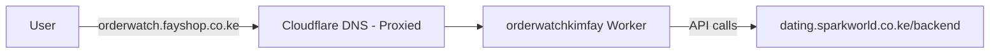

# OrderWatch Custom Domain Setup

Connect `orderwatch.fayshop.co.ke` (currently managed in cPanel) to the Cloudflare Worker `orderwatchkimfay` so users visit your branded domain instead of `https://orderwatchkimfay.nairobidental.workers.dev`.

---

## Architecture

| Component | Host | Role |
|-----------|------|------|
| Frontend (React / TanStack Start) | `orderwatch.fayshop.co.ke` | Cloudflare Worker `orderwatchkimfay` |
| API (Laravel) | `https://dating.sparkworld.co.ke/backend/public/api` | Separate server — not on cPanel for this subdomain |

The Worker serves the UI only. API calls go directly to the Laravel backend configured in `VITE_API_BASE_URL`.



---

## Why cPanel CNAME Does Not Work

You **cannot** point a cPanel DNS record at `orderwatchkimfay.nairobidental.workers.dev` and get a proper custom domain.

| Approach | Result |
|----------|--------|
| CNAME `orderwatch` → `*.workers.dev` in cPanel | Does not work for Worker Custom Domains |
| DNS-only (grey cloud) record | Cloudflare cannot attach the Worker or issue SSL |
| cPanel redirect to workers.dev URL | Users see the workers.dev hostname — not a real custom domain |

**Requirement:** The zone `fayshop.co.ke` must be an **active Cloudflare zone** in the same account as the Worker, with a **proxied** (orange cloud) DNS record for `orderwatch`.

---

## Recommended Setup

### Step 1 — Add `fayshop.co.ke` to Cloudflare

1. Log in to [Cloudflare Dashboard](https://dash.cloudflare.com) (account: `sparkworldke@gmail.com` — same account as Worker `orderwatchkimfay`).
2. Click **Add a site** → enter `fayshop.co.ke`.
3. Select the **Free** plan.
4. Cloudflare scans and imports existing DNS records from cPanel.

> You are moving **DNS control** to Cloudflare. cPanel can still host email, other subdomains, and other sites — you recreate those records in Cloudflare DNS.

---

### Step 2 — Change nameservers at your registrar

At your domain registrar (or wherever `fayshop.co.ke` nameservers are set), replace cPanel nameservers with the pair Cloudflare provides, for example:

```
ada.ns.cloudflare.com
bob.ns.cloudflare.com
```

Cloudflare shows the exact nameservers on the zone overview page after you add the site.

**Propagation:** 15 minutes to 48 hours.

---

### Step 3 — Recreate essential DNS in Cloudflare

Go to **Cloudflare → fayshop.co.ke → DNS → Records**.

Keep records your other services need:

| Purpose | Type | Name | Value | Proxy |
|---------|------|------|-------|-------|
| Main cPanel site | A | `@` or `www` | cPanel server IP | DNS only or Proxied |
| Email (if used) | MX | `@` | mail server hostname | — |

**Delete** any existing `orderwatch` A or CNAME record imported from cPanel. The Worker Custom Domain step creates the correct record automatically.

---

### Step 4 — Attach the domain to your Worker

#### Option A — Cloudflare Dashboard (easiest)

1. **Workers & Pages** → open `orderwatchkimfay`.
2. **Settings** → **Domains & Routes** → **Add** → **Custom Domain**.
3. Enter: `orderwatch.fayshop.co.ke`
4. Click **Add Custom Domain**.

Cloudflare automatically:

- Creates the proxied DNS record
- Issues an SSL certificate
- Routes all paths on that hostname to your Worker

#### Option B — Wrangler config (persists across deploys)

Add to `wrangler.jsonc` in the project root:

```jsonc
{
  "$schema": "node_modules/wrangler/config-schema.json",
  "name": "orderwatchkimfay",
  "compatibility_date": "2026-06-01",
  "compatibility_flags": ["nodejs_compat"],
  "main": "dist/server/server.js",
  "routes": [
    {
      "pattern": "orderwatch.fayshop.co.ke",
      "custom_domain": true
    }
  ],
  "assets": {
    "binding": "ASSETS",
    "directory": "dist/client"
  }
}
```

Then deploy:

```bash
npm run build
npx wrangler deploy
```

---

## Post-Setup Checklist

- [ ] `fayshop.co.ke` is an active zone in your Cloudflare account
- [ ] Nameservers point to Cloudflare (not cPanel)
- [ ] `orderwatch` DNS record is **Proxied** (orange cloud)
- [ ] Custom Domain `orderwatch.fayshop.co.ke` appears under Worker **Domains & Routes**
- [ ] https://orderwatch.fayshop.co.ke loads the app
- [ ] SSL certificate shows as active (Cloudflare handles this)

### Backend / app config

1. **CORS** — Add `https://orderwatch.fayshop.co.ke` to `backend/config/cors.php` allowed origins if not already present.

2. **Frontend API URL** — Production build uses `VITE_API_BASE_URL` from `.env`:
   ```env
   VITE_API_BASE_URL=https://dating.sparkworld.co.ke/backend/public/api
   ```
   Rebuild and redeploy after any change:
   ```bash
   npm run build
   npx wrangler deploy
   ```

3. **Azure OAuth (Outlook mailbox connect)** — If used, register this redirect URI in Azure AD → App registrations → Authentication:
   ```
   https://orderwatch.fayshop.co.ke/api/admin/mailboxes/oauth/callback
   ```
   > **Note:** The Laravel API currently lives on `dating.sparkworld.co.ke`. OAuth callbacks must match where the API actually runs. If the callback is on the Laravel server, use:
   ```
   https://dating.sparkworld.co.ke/backend/public/api/admin/mailboxes/oauth/callback
   ```
   The URI in Azure AD and `MICROSOFT_REDIRECT_URI` in backend `.env` must be **character-for-character identical**.

---

## If You Cannot Change Nameservers

If `fayshop.co.ke` must remain 100% on cPanel DNS, Worker Custom Domains are not supported for that hostname.

**Workarounds (not recommended for production):**

| Option | Trade-off |
|--------|-----------|
| cPanel redirect to workers.dev | Users may see workers.dev URL; poor UX |
| Keep workers.dev as primary URL | No branded domain |

The production-grade path is **Cloudflare DNS for `fayshop.co.ke` + Worker Custom Domain**.

---

## Troubleshooting

### Error: “DNS label must contain only a-z, A-Z, 0-9, -, and _”

This means a **single label** (one part of the hostname) has invalid characters — usually a **dot** or **full URL** pasted into the wrong field.

| Where you are | Wrong (causes error) | Correct |
|---------------|----------------------|---------|
| **cPanel → Subdomains** | `orderwatch.fayshop.co.ke` | `orderwatch` only |
| **cPanel → Zone Editor → Name** | `orderwatch.fayshop.co.ke` | `orderwatch` only |
| **Cloudflare → DNS → Name** | `orderwatch.fayshop.co.ke` | `orderwatch` only |
| **Cloudflare → Worker → Custom Domain** | `https://orderwatch.fayshop.co.ke/` | `orderwatch.fayshop.co.ke` (no `https://`, no trailing `/`) |

**Do not** try to create `orderwatch` as a CNAME to `orderwatchkimfay.nairobidental.workers.dev` in cPanel — that path does not work for Worker Custom Domains even if the record saves.

**Current bad record (remove after Cloudflare takes over):**
```
orderwatch.fayshop.co.ke  CNAME  orderwatchkimfay.nairobidental.workers.dev
```

---

### “No nameservers” in cPanel

**Normal.** cPanel usually does **not** let you change domain nameservers. Nameservers are set at your **domain registrar** or **hosting provider DNS panel**, not inside cPanel’s subdomain screens.

**Current nameservers for `fayshop.co.ke` (as of setup):**
```
ns1.noc254.com
ns2.noc254.com
rs11.rcnoc.com
rs12.rcnoc.com
```

These are Kenyan hosting DNS (`noc254.com` / `rcnoc.com`). To use Cloudflare Workers Custom Domain you must change nameservers **where those four are configured** — typically:

1. The company where you **registered** `fayshop.co.ke` (Kenya NIC reseller, Truehost, Kenya Web Experts, etc.), **or**
2. Your hosting provider’s **client area** (separate from cPanel login), under **Domain → Nameservers**

**cPanel is only for:** hosting files, email mailboxes, subdomain folders — **not** for pointing the whole domain to Cloudflare.

#### What to do

1. Log in to wherever you manage `fayshop.co.ke` registration (not cPanel unless it has a “Domains” / “Nameservers” section).
2. Add `fayshop.co.ke` to Cloudflare first → Cloudflare gives you two nameservers, e.g.:
   ```
   ada.ns.cloudflare.com
   bob.ns.cloudflare.com
   ```
3. Replace `ns1.noc254.com` / `ns2.noc254.com` / `rs11.rcnoc.com` / `rs12.rcnoc.com` with Cloudflare’s pair.
4. In **Cloudflare DNS**, recreate records your cPanel site still needs (A record to cPanel server IP for `@` / `www`, MX for mail).
5. Add Worker Custom Domain `orderwatch.fayshop.co.ke` in Cloudflare (Step 4 above).

> **Ask your host:** “Where do I change nameservers for fayshop.co.ke?” If they say “we manage DNS,” request Cloudflare nameserver change or a ticket to delegate `orderwatch` — most shared hosts will only allow full-zone NS change.

---

### Other issues

| Symptom | Likely cause | Fix |
|---------|--------------|-----|
| Custom Domain add fails | Zone not on Cloudflare | Complete Steps 1–2 (nameserver change at registrar) |
| Custom Domain add fails | Existing CNAME on `orderwatch` | Delete `orderwatch` CNAME in Cloudflare DNS after zone import |
| SSL certificate pending | DNS not propagated | Wait up to 48h; ensure record is Proxied (orange cloud) |
| App loads but API errors | CORS | Add custom domain to `config/cors.php` |
| OAuth `AADSTS500113` | Redirect URI mismatch | Align Azure AD URI with backend `.env` |

---

## Reference

| Setting | Value |
|---------|-------|
| Worker name | `orderwatchkimfay` |
| Workers.dev URL | `https://orderwatchkimfay.nairobidental.workers.dev` |
| Target custom domain | `https://orderwatch.fayshop.co.ke` |
| Cloudflare account | `sparkworldke@gmail.com` |
| Production API | `https://dating.sparkworld.co.ke/backend/public/api` |
| Deploy commands | `npm run build` then `npx wrangler deploy` |

---

## Related docs in this repo

- `cloudflare-custom-domain-setup.md` — earlier Workers custom domain notes
- `azure-ad-redirect-uri-fix.md` — Outlook OAuth redirect URI setup