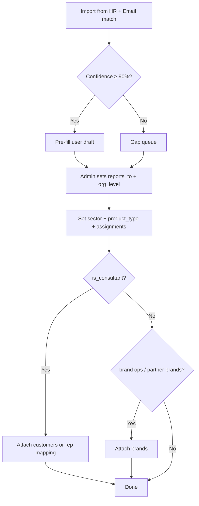

# Team & Org Chart PRD — Leak-Free Data Scoping

**Status:** Draft for review  
**Date:** 9 July 2026  
**Sources:** `Active Email Users(1).xlsx`, `Active staff July 2026- HQ.xlsx`, existing `team-management` implementation (PR1–PR7)

---

## 1. Problem Statement

OrderWatch already has department-based scoping (`DepartmentScope`), consultant rep-code scoping (`SalesConsultantScope`), brand filters, and session tracking. What is missing is a **formal org chart** that:

1. Models reporting lines (Executive → C-Suite → HOD → Sales / Brand Ops / Operations).
2. Lets HODs see **their reportees' data** (recursive subtree), not just their own department slice.
3. Supports **cross-functional roles** (e.g. Head of Partner Brands sees trading data across GT, MT, and KP).
4. Attaches **customers/outlets** to KAMs and sales consultants, and **brands** to Brand Ops — without leaking data across boundaries.
5. Provides a **Gaps** workflow for users who cannot be auto-matched from HR spreadsheets.
6. Remains **admin-updatable** without code changes.

---

## 2. Goals & Non-Goals

### Goals

| # | Goal |
|---|------|
| G1 | Match active email users to HQ staff records with confidence scoring |
| G2 | Seed/update users from matched list; flag unmatched as Gaps |
| G3 | Org chart with `reports_to_user_id` and five org levels |
| G4 | Leak-free composite data scope (sector × product type × customer × brand × subtree) |
| G5 | HOD subtree visibility for orders, customers, fill rate, backorders, inventory, customer feed, business optimization |
| G6 | Admin UI to attach users to org chart, assignments, and privileges |
| G7 | Automated leak tests per persona |

### Non-Goals (this phase)

- Replacing Acumatica as source of truth for rep codes (manual mapping remains) Add Matching to Customers or SOs.
- Real-time HR sync from payroll (batch import only).
- Rebuilding the permission/role system (org scope stacks on top of existing roles).

---

## 3. Org Structure

### 3.1 Levels

```
executive
  └── c_suite
        └── hod
              ├── sales        (consultants, KAMs, regional managers)
              ├── brandsops    (partner brand operators)
              └── operations   (CS, Finance, Marketing, Procurement, Production, Store, Dispatch)
```

### 3.2 Reporting Rules

| Rule | Description |
|------|-------------|
| R1 | C-Suite reports to Executive (or Chairman where applicable) |
| R2 | HODs report to a C-Suite member |
| R3 | Sales, Brand Ops, and Operations staff report to an HOD **or** directly to C-Suite |
| R4 | A user has exactly one `reports_to_user_id` (nullable only for top executive & Operations) |
| R5 | Subtree = user + all descendants via `reports_to_user_id` (recursive) |

### 3.3 Sector & Function Tags

Every user carries:

- **Sector scope** — one or more of `GT`, `MT`, `KP`, or `ALL` (operations / executive).
- **Function** — maps to existing `departments.slug` (e.g. `gt`, `mt_consumer_sales`, `kp`, `partner_brands`, `customer_service`, `finance`, …).
- **Product type scope** — `manufactured`, `trading`, or `both` (default `both` for sales HODs; `trading` only for Partner Brands).

Operations support functions (Customer Service, Finance, Marketing, Procurement, Production, Store, Dispatch) use `sector_scope = ALL` and **org-wide customer data** (same as today's non-customer-facing departments).

---

## 4. Persona Reference (from requirements + spreadsheet match)

| Persona | Matched record | Proposed org config | Data they must see | Data they must NOT see |
|---------|----------------|---------------------|--------------------|------------------------|
| **Vignesh** (Executive oversight) | `cco@kimfay.com` → P320, CCO | `org_level=c_suite`*, `sector=ALL`, reports to Chairman (P300) | Everything all sectors, manufactured + trading | — |
| **C-Suite / Ops** (CS, Finance, Marketing, …) | e.g. `hr@kimfay.com`, `dispatch@kimfay.com` | `org_level=operations` or `c_suite`, `sector=ALL` | Org-wide operational data | Revenue if role masked |
| **Purity** (MT HOD) | `moderntrade@kimfay.com` → P496, Modern Trade Manager | `org_level=hod`, `function=mt_consumer_sales`, `sector=[MT]`, `product_type=both` | MT customers/orders/SKUs for manufactured + trading; all reportee data in subtree | GT, KP |
| **Jane** (KAM) | `jane.kac@kimfay.com` → P076, MT Rep *(example; Carrefour outlets assigned manually)* | `org_level=sales`, `is_consultant=true`, `sector=[MT]`, customer assignments | Only assigned outlet customers (work backwards from SOs) | Other MT/GT/KP customers |
| **Muthoni** (Partner Brands HOD) | `partnerbrands@kimfay.com` → P086, Head of Partner Brands | `org_level=hod`, `function=partner_brands`, `sector=[GT,MT,KP]`, `product_type=trading` | All trading/partner-brand data across sectors; subtree reportees | Manufactured-only SKUs outside partner brands |
| **Brand Ops** (e.g. Adan) | `brandoperations.unilever@kimfay.com` → P456 | `org_level=brandsops`, brand assignments `[Unilever,…]`, `product_type=trading` | All partner-brand trading data; filter UI by assigned brands | Customer-specific restrictions (none by default); manufactured |
| **Steve** (GT HOD — example) | salesstrategy@kimfay.com | `org_level=hod`, `function=gt`, `sector=[GT]`, `product_type=both` | GT portfolio + reportees | MT, KP |
| **Susan** (KP HOD) | `susan@kimfay.com` → P025, BDM Professional Sales | `org_level=hod`, `function=kp`, `sector=[KP]`, `product_type=both` | KP portfolio + reportees | GT, MT |

\* Vignesh is CCO; treat as `c_suite` with `data_scope_mode=org_wide` equivalent to executive visibility. Chairman/CEO (P300/P301) are `executive` and all operation departments.

---

## 5. Staff ↔ Email Matching Results

Matching script: `agent-tools/match_staff_emails.py`  
Outputs: `docs/data/staff_email_match.xlsx`, `docs/data/staff_email_gaps.xlsx`, `agent-tools/staff_email_match.json`

### 5.1 Summary

| Metric | Count |
|--------|------:|
| Active email rows | 141 |
| HQ staff rows (Permanent + STC) | 526 |
| High-confidence matches (≥ 90%) | 80 |
| Medium-confidence matches | 3 |
| Low-confidence / unmatched emails | 58 |
| Staff with no email (STC-heavy) | 443 |

### 5.2 High-confidence breakdown

| Inferred org level | Count |
|--------------------|------:|
| HOD | 24 |
| Sales | 26 |
| Brand Ops | 5 |
| C-Suite | 6 |
| Executive | 3 |
| Gap (matched staff but unclear level) | 16 |

| Inferred function | Count |
|-------------------|------:|
| MT / Consumer Sales | 20 |
| Partner Brands | 9 |
| Finance | 16 |
| Marketing | 6 |
| Procurement | 4 |
| HR | 3 |
| Production | 2 |
| IT | 3 |
| Unclassified (needs manual) | 17 |

### 5.3 Key confirmed matches

| Email | Display name | Employee # | Department / designation | Proposed org |
|-------|--------------|-------------|--------------------------|--------------|
| `cco@kimfay.com` | Vignesh Ramachandran | P320 | C-Suite / CCO | `c_suite`, ALL sectors |
| `partnerbrands@kimfay.com` | Christine Muthoni | P086 | Head of Partner Brands | `hod`, partner_brands, trading |
| `moderntrade@kimfay.com` | Purity Nduku Kioko | P496 | Modern Trade Manager | `hod`, mt_consumer_sales, MT |
| `susan@kimfay.com` | Susan Ngina | P025 | BDM Professional Sales | `hod`, kp, KP |
| `jane.kac@kimfay.com` | Jane Kuria | P076 | MT Representative | `sales`, MT, consultant + customers |
| `brandoperations.unilever@kimfay.com` | Adan Gulleid | P456 | Brands Operations Manager | `brandsops`, Unilever brand |

### 5.4 Gaps workflow

Users land in `org_level = gap` when:

- **Email gap** — active email exists but no staff row matched (58 users: interns, shared mailboxes, `orders@`, `dispatchclerk*`, etc.).
- **Staff gap** — HQ staff without OrderWatch email (443 STC/warehouse staff; expected).
- **Classification gap** — matched but function/org level unclear (manual review queue).

**Admin actions for gaps:**

1. Link email → employee number manually.
2. Set org level, reports-to, sector, product type.
3. Mark as `shared_mailbox` (no login) or `inactive_candidate` if not app users.
4. Re-run seeder import without overwriting admin corrections (`preserve_manual_overrides` flag).

---

## 6. Leak-Free Data Scope Model

Data visibility is the **intersection** of independent scope layers. If any layer yields an empty set, the user sees nothing for that dimension (fail closed).

### 6.1 Scope layers (evaluated in order)

```
┌─────────────────────────────────────────────────────────────┐
│ L0  Super Admin / Administrator → BYPASS (all data)         │
├─────────────────────────────────────────────────────────────┤
│ L1  Org-wide flag (executive, c_suite w/ flag, operations)  │
│     → skip L2–L5 for customer/order scope                   │
├─────────────────────────────────────────────────────────────┤
│ L2  Sector scope (GT / MT / KP) via customer_class prefix   │
├─────────────────────────────────────────────────────────────┤
│ L3  Product type (manufactured / trading / both) on SKU/SO  │
├─────────────────────────────────────────────────────────────┤
│ L4  Customer assignment (sales, KAM, consultants)         │
│     OR rep-code SO linkage (legacy SalesConsultantScope)     │
├─────────────────────────────────────────────────────────────┤
│ L5  Brand assignment (brand ops, partner brands HOD)      │
├─────────────────────────────────────────────────────────────┤
│ L6  Subtree union (HOD / managers): own scope ∪ reportees   │
└─────────────────────────────────────────────────────────────┘
```

### 6.2 Layer definitions

| Layer | Applies when | Rule |
|-------|--------------|------|
| **L1 Org-wide** | `data_scope_mode = org_wide` | No sector/customer/brand restriction. Menu/role permissions still apply. |
| **L2 Sector** | `sector_scope` ≠ ALL | Customer class prefix map (`KP→kp`, `MT→mt_consumer_sales`, `GT→gt`) + `customer_department_overrides`. |
| **L3 Product type** | `product_type_scope ≠ both` | Inventory/SO lines: `trading` = partner-brand items only; `manufactured` = Kimfay-manufactured only. Uses `inventory_items.classification` / brand metadata. |
| **L4 Customer** | `org_level ∈ {sales}` AND `is_consultant` OR explicit `user_customer_assignments` | User sees only assigned customers. Fallback: derive customers from SOs where `consultant_user_id = user` or `sales_consultant_rep_code = rep_code`. |
| **L5 Brand** | `org_level ∈ {hod, brandsops}` AND `function = partner_brands` OR `user_brand_assignments` non-empty | Trading SKUs/orders where brand ∈ assigned set. Brand Ops may filter narrower in UI but cannot expand beyond assignment. |
| **L6 Subtree** | `org_level ∈ {executive, c_suite, hod}` OR user has reportees | Effective scope = ⋃ scope(reportee) for all descendants. HOD does **not** automatically get org-wide; only union of reportee scopes within their own L2–L5 bounds. |

### 6.3 Leak prevention matrix

| Viewer type | GT order | MT order | KP order | Trading brand (all sectors) | Mfg SKU | Unassigned customer | Other dept reportee |
|-------------|:--------:|:--------:|:--------:|:---------------------------:|:-------:|:-------------------:|:-------------------:|
| Executive | ✓ | ✓ | ✓ | ✓ | ✓ | ✓ | ✓ |
| C-Suite / Ops | ✓ | ✓ | ✓ | ✓ | ✓ | ✓ | ✓ |
| MT HOD (Purity) | ✗ | ✓ | ✗ | ✓* | ✓ | ✗** | ✓*** |
| GT HOD (Steve) | ✓ | ✗ | ✗ | ✓* | ✓ | ✗** | ✓*** |
| KP HOD (Susan) | ✗ | ✗ | ✓ | ✓* | ✓ | ✗** | ✓*** |
| Partner Brands HOD | ✓† | ✓† | ✓† | ✓ | ✗ | ✓† | ✓*** |
| Brand Ops | ✓† | ✓† | ✓† | ✓ (assigned brands) | ✗ | ✓† | ✗ |
| KAM / Consultant | sector only | sector only | sector only | per customer | per customer | ✗ | ✗ |
| Gap (unconfigured) | ✗ | ✗ | ✗ | ✗ | ✗ | ✗ | ✗ |

\* Trading only if `product_type_scope` includes trading.  
\** HOD sees department portfolio, not arbitrary unassigned customers.  
\*** Only reportees in their subtree.  
† Trading/partner-brand slice only; no manufactured-only leakage.

**Default for unconfigured users:** `data_scope_mode = deny_all` (fail closed). Gap users cannot see operational data until an admin completes org attachment.

### 6.4 Stacking with existing code

Current `DataScope` = `SalesConsultantScope` ∩ `DepartmentScope`.  
Target `DataScope` = `OrgScope` ∪ `SubtreeScope` where:

```php
OrgScope = SectorScope ∩ ProductTypeScope ∩ CustomerScope ∩ BrandScope
EffectiveScope(user) =
    if orgWide(user) → ALL
    else if hasReportees(user) → ⋃_{r ∈ subtree(user)} OrgScope(r)
    else → OrgScope(user)
```

`SalesConsultantScope` remains as **fallback** inside `CustomerScope` when `user_customer_assignments` is empty but `is_consultant && rep_code` is set.

---

## 7. How to Attach a User to the Org Chart

### 7.1 Required fields (admin `/app/team` or Administration → Team)

| Field | DB column / table | Notes |
|-------|-------------------|-------|
| Display name | `users.name` | From email or HR |
| Email | `users.email` | OTP login |
| Employee number | `users.employee_number` | From HR; links to rep mapping |
| App role | `users.role` | Existing permission role (unchanged) |
| Department / function | `users.department_id` | FK → `departments` |
| Department role | `users.department_role` | `member` \| `hod` \| `executive` (kept for backward compat) |
| **Org level** | `users.org_level` | `executive` \| `c_suite` \| `hod` \| `sales` \| `brandsops` \| `operations` \| `gap` |
| **Reports to** | `users.reports_to_user_id` | FK → `users.id`; validated acyclic |
| **Sector scope** | `user_sector_scopes` | Rows: `GT`, `MT`, `KP` or `ALL` |
| **Product type** | `users.product_type_scope` | `manufactured` \| `trading` \| `both` |
| **Data scope mode** | `users.data_scope_mode` | `org_wide` \| `scoped` \| `deny_all` |
| Consultant flag | `users.is_consultant` | Enables order attachment |
| Rep code | `users.rep_code` + `user_acumatica_rep_mappings` | Acumatica linkage |
| **Customer assignments** | `user_customer_assignments` | Optional explicit outlet list |
| **Brand assignments** | `user_brand_assignments` | For brand ops / partner brands |

### 7.2 Attachment flow



### 7.3 Role vs org level vs permissions

| Concept | Purpose | Example |
|---------|---------|---------|
| **App role** (`users.role`) | Menu + action permissions | `Sales Operations`, `Executive` |
| **Org level** | Data scope + reporting tree | `hod`, `sales` |
| **Department role** | Legacy HOD flag inside department | `hod` — migrate to `org_level` over time |
| **is_consultant** | Order/consultant guardrail | KAM Jane |
| **data_scope_mode** | Override for C-Suite / ops | `org_wide` |

Privileges = **role permissions** (what you can do) × **data scope** (what rows you see). Neither replaces the other.

### 7.4 Proposed reporting tree (seed defaults — admin editable)

```
Resham Singh Bains (P300, Chairman)          [executive]
└── Rajdeep Singh Bains (P301, CEO)          [executive]
    └── Vignesh Ramachandran (P320, CCO)     [c_suite, org_wide]
        ├── Purity Nduku Kioko (P496)        [hod, MT]
        ├── Susan Ngina Mwathi (P025)        [hod, KP]
        ├── Anne Christine Muthoni (P086)    [hod, partner_brands, trading]
        ├── Steve (manual)                   [hod, GT]
        ├── Beatrice Luteshi (P014)          [hod, customer_service]
        ├── Vincent Musyoka (P277)           [hod, dispatch]
        └── … other HODs …
            └── sales / brandsops reportees
```

---

## 8. Database Migration (new)

Existing: `2026_07_13_000001_create_team_management_tables.php` (departments, rep mappings, sessions, consultant audits).

**New migration:** `2026_07_14_000001_create_org_chart_and_scoping_tables.php`

```php
// users extensions
$table->string('org_level', 20)->default('gap')->after('department_role');
$table->foreignId('reports_to_user_id')->nullable()->constrained('users')->nullOnDelete();
$table->string('product_type_scope', 20)->default('both'); // manufactured|trading|both
$table->string('data_scope_mode', 20)->default('deny_all'); // org_wide|scoped|deny_all
$table->boolean('is_shared_mailbox')->default(false);
$table->index('reports_to_user_id');

// user_sector_scopes
Schema::create('user_sector_scopes', function (Blueprint $table) {
    $table->id();
    $table->foreignId('user_id')->constrained()->cascadeOnDelete();
    $table->string('sector', 5); // GT|MT|KP|ALL
    $table->unique(['user_id', 'sector']);
});

// user_customer_assignments
Schema::create('user_customer_assignments', function (Blueprint $table) {
    $table->id();
    $table->foreignId('user_id')->constrained()->cascadeOnDelete();
    $table->string('customer_acumatica_id', 50);
    $table->string('assignment_type', 20)->default('primary'); // primary|kam|overlay
    $table->foreignId('assigned_by')->nullable()->constrained('users')->nullOnDelete();
    $table->text('notes')->nullable();
    $table->timestamps();
    $table->unique(['user_id', 'customer_acumatica_id']);
    $table->index('customer_acumatica_id');
});

// user_brand_assignments
Schema::create('user_brand_assignments', function (Blueprint $table) {
    $table->id();
    $table->foreignId('user_id')->constrained()->cascadeOnDelete();
    $table->string('brand', 100);
    $table->foreignId('assigned_by')->nullable()->constrained('users')->nullOnDelete();
    $table->timestamps();
    $table->unique(['user_id', 'brand']);
});

// org_chart_audit (compliance)
Schema::create('org_chart_audits', function (Blueprint $table) {
    $table->id();
    $table->foreignId('user_id')->constrained()->cascadeOnDelete();
    $table->foreignId('changed_by')->nullable()->constrained('users')->nullOnDelete();
    $table->json('before')->nullable();
    $table->json('after')->nullable();
    $table->string('change_type', 30);
    $table->timestamps();
});

// staff_import_gaps
Schema::create('staff_import_gaps', function (Blueprint $table) {
    $table->id();
    $table->string('email')->nullable();
    $table->string('employee_number', 20)->nullable();
    $table->string('display_name')->nullable();
    $table->string('gap_reason', 40);
    $table->decimal('match_score', 4, 3)->nullable();
    $table->json('source_payload')->nullable();
    $table->string('resolution_status', 20)->default('open'); // open|linked|ignored
    $table->foreignId('resolved_user_id')->nullable()->constrained('users')->nullOnDelete();
    $table->timestamps();
});
```

### 8.1 Department seeder additions

Add to `DepartmentSeeder`:

- `partner_brands` (customer-facing: **no** — uses brand scope instead)
- `finance`, `procurement` (non-customer-facing, org-wide)

### 8.2 Config additions (`config/departments.php`)

```php
'org_levels_with_subtree_visibility' => ['executive', 'c_suite', 'hod'],
'fail_closed_org_level' => 'gap',
'default_product_type_by_function' => [
    'partner_brands' => 'trading',
    'mt_consumer_sales' => 'both',
    'gt' => 'both',
    'kp' => 'both',
],
```

---

## 9. Seeder & Import Command

**Command:** `php artisan team:import-staff {--dry-run} {--preserve-manual}`

**Input:** `docs/data/staff_email_match.xlsx`

**Logic:**

1. For each row with `match_confidence = high`:
   - `User::updateOrCreate(['email' => …])` with name, employee_number, inferred department.
   - Set `org_level`, `product_type_scope`, `data_scope_mode` from inference rules.
   - Insert `user_sector_scopes`.
   - Do **not** auto-set `reports_to_user_id` except documented seed tree (§7.4).
2. For `low` / unmatched → insert `staff_import_gaps`.
3. `--preserve-manual` skips users where `org_chart_audits` shows admin edits.

**Customer assignment backfill command:** `php artisan team:backfill-customers {user}`

- Query distinct `customer_acumatica_id` from `acumatica_sales_orders` where rep_code matches user's `user_acumatica_rep_mappings` or legacy SO consultant fields.
- Insert into `user_customer_assignments` for consultants/KAMs.

---

## 10. Backend Services (implementation outline)

| Service | Responsibility |
|---------|----------------|
| `OrgTreeService` | `descendants(user)`, `ancestors(user)`, cycle detection |
| `SectorScope` | Wraps / replaces prefix portion of `DepartmentScope` using `user_sector_scopes` |
| `ProductTypeScope` | Filters inventory/SO lines by manufactured vs trading |
| `CustomerAssignmentScope` | Explicit assignments + consultant rep fallback |
| `BrandAssignmentScope` | Partner brand filtering |
| `SubtreeScope` | Unions scopes for reportees |
| `OrgScopeResolver` | Combines layers; single entry for controllers |
| `StaffImportService` | Parses xlsx, writes users + gaps |

**Controller touchpoints:** All endpoints already using `DataScope::applyCustomerScope` / `applyOrderScope` — swap internals to `OrgScopeResolver` without changing controller signatures.

---

## 11. Admin UI Changes

### Team page (`/app/team`)

| UI block | Fields |
|----------|--------|
| Org chart picker | Reports-to autocomplete (search by name/email) |
| Org level select | executive / c_suite / hod / sales / brandsops / operations / gap |
| Sector tags | Multi-select GT, MT, KP, ALL |
| Product type | manufactured / trading / both |
| Data scope mode | org_wide / scoped / deny_all |
| Customer assignments | Multi-select customers (search Acumatica); "derive from SOs" button |
| Brand assignments | Multi-select brands (from inventory brand catalog) |
| Gap resolution | Link gap row → user; mark ignored |

### Administration → Team tab

- Gap queue table (from `staff_import_gaps`)
- Org chart audit log viewer
- Session history (already implemented)

---

## 12. Test Plan

Extend `TeamManagementTest` and add `OrgScopeLeakTest`.

### 12.1 Unit tests

| Test | Assert |
|------|--------|
| `OrgTreeService` cycle detection | Reject `A→B→A` |
| `OrgTreeService` descendants | 3-level tree returns correct IDs |
| `SectorScope` | MT user excludes GT customer class |
| `ProductTypeScope` | `trading` excludes manufactured SKU |
| `BrandAssignmentScope` | Unilever ops cannot see Nestlé trading SKU |
| `SubtreeScope` | MT HOD sees consultant's customer but not sibling HOD's |

### 12.2 Feature / leak tests (persona fixtures)

| Test case | User fixture | Must see | Must not see |
|-----------|--------------|----------|--------------|
| `executive_sees_all_sectors` | Vignesh fixture | GT+MT+KP customers | — |
| `mt_hod_sector_isolation` | Purity fixture | MT-CUST-1 | GT-CUST-1, KP-CUST-1 |
| `mt_hod_sees_reportee_customer` | Purity + Jane child | Carrefour customer | Non-reportee MT customer |
| `kp_consultant_customer_only` | Susan child consultant | Assigned KP customer | Other KP customer |
| `partner_brands_trading_only` | Muthoni fixture | Trading SKU all sectors | Manufactured-only SKU |
| `brand_ops_brand_filter` | Adan fixture | Unilever trading | Other partner brand (unless assigned) |
| `gap_user_denied` | Unconfigured gap | — | Any customer/order |
| `operations_org_wide` | Dispatch manager | All customers | — |
| `customer_feed_scoped` | MT consultant | MT assigned feed | GT feed |
| `business_optimization_scoped` | KP HOD subtree | KP metrics for team | GT metrics |
| `inventory_brand_sector_cross` | Muthoni | GT trading line | GT manufactured line |
| `hod_no_sibling_leak` | Purity | — | GT HOD reportee data |

### 12.3 API endpoints to cover

- `GET /api/customers`
- `GET /api/orders`
- `GET /api/operations/fill-rate`
- `GET /api/operations/backorders`
- `GET /api/inventory`
- `GET /api/customer-feed`
- `GET /api/operations/business-optimization`
- `GET /api/dashboard/*`

Each test creates minimal fixtures for two sectors + two brands + two customers and asserts counts/IDs.

---

## 13. Implementation PR Stack

| PR | Scope | Depends |
|----|-------|---------|
| **PR8** | Migration §8 + models + `OrgTreeService` | — |
| **PR9** | `OrgScopeResolver` + refactor `DataScope` internals | PR8 |
| **PR10** | `team:import-staff` + gap table + xlsx seed | PR8 |
| **PR11** | Admin UI — org chart, sectors, assignments, gaps | PR8, PR10 |
| **PR12** | `team:backfill-customers` from SOs | PR8 |
| **PR13** | Leak test suite §12 | PR9 |
| **PR14** | Reporting tree seed + manual overrides for Steve / shared mailboxes | PR10, PR11 |

---

## 14. Open Questions for Stakeholder Sign-off

1. **Vignesh / CCO** — confirm `org_wide` alongside Chairman/CEO or only below CEO?
2. **Steve (GT HOD)** — which email / employee number should be canonical?
3. **Shared mailboxes** (`orders@`, `sales@`) — deactivate for OTP or map to service account with `deny_all`?
4. **Jane / Carrefour** — provide outlet customer list or rely 100% on SO backfill?
5. **Regional managers** — do they get subtree of consultants only, or full sector portfolio like HOD?
6. **Revenue masking** — which org levels mask by default?

---

## 15. Artifacts

| File | Purpose |
|------|---------|
| `team.md` | This PRD |
| `docs/data/staff_email_match.xlsx` | Full matched user list with inferred org fields |
| `docs/data/staff_email_gaps.xlsx` | Email + staff gaps for manual resolution |
| `agent-tools/staff_email_match.json` | Machine-readable match output |
| `agent-tools/match_staff_emails.py` | Re-runnable matcher |

---

## 16. Acceptance Criteria

- [ ] Admin can place any user on org chart with reports-to and org level.
- [ ] HOD sees own scope ∪ all reportee data; never sibling HOD data.
- [ ] MT/GT/KP isolation holds for HODs and consultants.
- [ ] Partner Brands HOD sees trading across sectors without manufactured leakage.
- [ ] Brand Ops see assigned partner brands; no customer attachment required.
- [ ] KAM/consultant sees only assigned / SO-derived customers.
- [ ] Gap users see no operational data until configured.
- [ ] 80 high-confidence users importable via artisan command.
- [ ] All leak tests in §12 pass in CI.